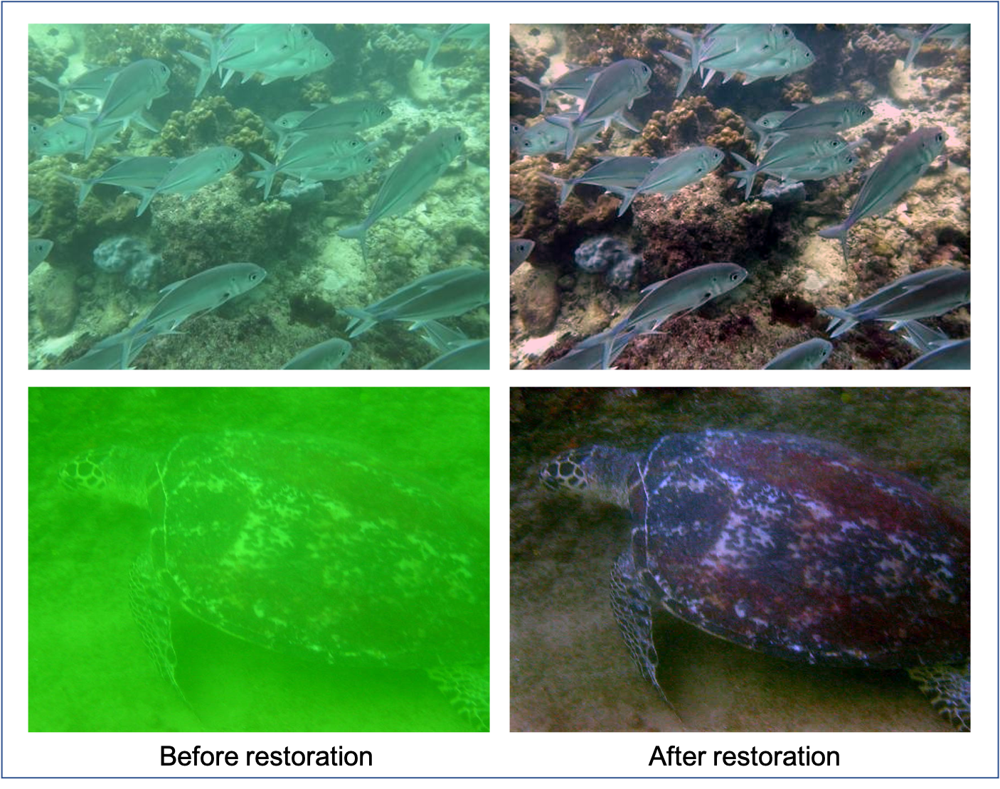

# MonoUIR
Implementation of "Towards Underwater Image Restoration: A Physical-accurate Pipeline and a Large Scale Full-reference Benchmark, International Conference on Multimedia and Expo(ICME), 2022"

### 1. Prerequisites

```Cmd
sudo apt install python3-tk
pip3 install -r requirements.txt
```

### 2. Run the project

There are two test underwater images in `Input` folder for demo.

Run

```Cmd
python3 MonoUIR.py
```

and you will get result images in `Output` folder.

You can change the configurations of the pipeline in `MonoUIR.py`

### 3. RUCB dataset
链接: https://pan.baidu.com/s/1E-e0hKch06ikioyD9GvxCw 提取码: v28d

### 4. Demo


Video demo can be obtained in `Demo` folder.


